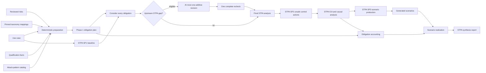
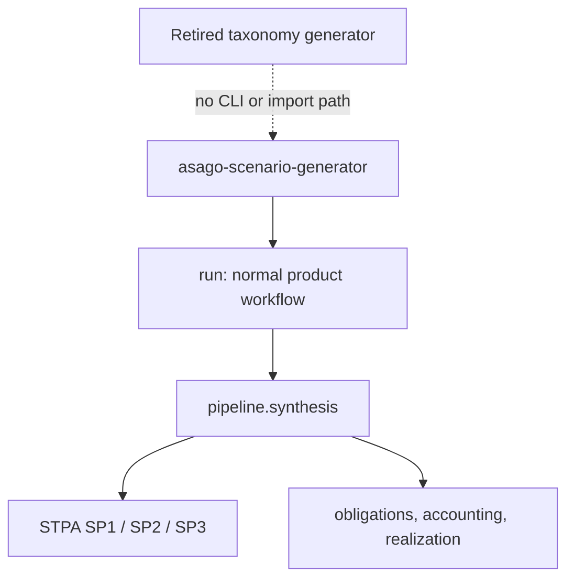
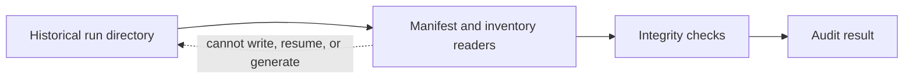

# STPA-led product data flow

Asago has one normal scenario-generation workflow. Taxonomy supplies reviewed
risks, mappings, qualification evidence, and obligations; STPA owns all
scenario authoring.

## End-to-end `generate`

An obligation is a question STPA must consider. It does not prescribe an
attack sequence or force scenario creation.

## Main inputs and outputs

| Boundary | Inputs | Outputs |
|---|---|---|
| Preparation | use case, reviewed risks, taxonomy mappings, capability profile/facts, attack-pattern catalog | typed projection evidence and pins |
| Phase 1 | prepared taxonomy evidence | `taxonomy-obligation-plan.yaml` |
| STPA baseline and consideration | use case, capability profile, obligation briefs | loss analysis, control structure, obligation consideration |
| Bounded revision | explicit upstream gaps | preserved baseline plus at most one additive revision and final recheck |
| STPA scenario production | final loss/control/ICA authority | STPA scenario artifacts and scenario handoff |
| Accounting | every obligation and final ICA evidence | `obligation-accounting.yaml`, `scenario-realization.yaml` |

## Command boundary

`generate` is the only scenario-generation command. The retired
taxonomy generator cannot be invoked through the CLI and has no remaining
scenario-authoring implementation.

## Historical artifact audit

Old manifest-v3 taxonomy runs may be parsed for explicit audit. That boundary
is read-only:

